# flux-infra-monitoring 📊

FLUX-INFRA-MONITORING є репозиторієм для тестування та експериментів з моніторингом. Використовуючи цей репозиторій, ви можете налаштувати та запустити різні механізми моніторингу для ваших додатків та систем.

## Навігація

- [flux-infra-monitoring 📊](#flux-infra-monitoring-)
  - [Навігація](#навігація)
  - [Огляд 👀](#огляд-)
  - [Встановлення та налаштування ⚙️](#встановлення-та-налаштування-️)
  - [Конфігурація Fluentbit](#конфігурація-fluentbit)
- [Спочатку зареєструйте Git-репозиторій на вашому кластері:](#спочатку-зареєструйте-git-репозиторій-на-вашому-кластері)
- [Встановлення стеку Prometheus](#встановлення-стеку-prometheus)
- [Встановлення стеку Loki](#встановлення-стеку-loki)
- [Встановлення панелей інструменту Grafana для Flux](#встановлення-панелей-інструменту-grafana-для-flux)
- [Для встановлення opentelemetry-operator у наявному кластері переконайтеся, що cert-manager встановлено та запустіть](#для-встановлення-opentelemetry-operator-у-наявному-кластері-переконайтеся-що-cert-manager-встановлено-та-запустіть)
- [Встановлення opentelemetry-operator](#встановлення-opentelemetry-operator)
- [Встановлення Tempo](#встановлення-tempo)
- [Ви можете отримати доступ до Grafana за допомогою перенаправлення портів:](#ви-можете-отримати-доступ-до-grafana-за-допомогою-перенаправлення-портів)
  - [Доступ до моніторингових сервісів](#доступ-до-моніторингових-сервісів)
  - [Приклад використання](#приклад-використання)
  - [Допоміжні ресурси](#допоміжні-ресурси)
  - [DEMO](#demo)

## Огляд 👀

У цьому репозиторії ви знайдете стек інструментів для моніторингу:
* Prometheus 🗂️
* Open Telemetry 🌐
* Grafana 📈
* Loki 📜
* Fluent-bit 💬

## Встановлення та налаштування ⚙️

1. Склонуйте репозиторій до вашого локального середовища:

   ```bash
   git clone https://github.com/matvrus/flux-infra-monitoring.git
   cd k-monitoring
   ```

2. Найлегший спосіб запуску - використовуючи `docker-compose`.
   
   ```bash
   docker-compose up -d
   ```
   або без флагу -d щоб бачити процес
      ```bash
   docker-compose up 
   ```

3. Запустіть моніторинговий сервіс та сервіс сповіщень.

## Робота сервісів ⚙️

Кожен сервіс налаштований на окремому порті:
* Grafana: http://localhost:3002
* OpenTelemetry: http://localhost:4317
* Prometheus: http://localhost:9090

Перейдіть до сервісу Grafana та налаштуйте моніторинг до ваших потреб. Ви можете використовувати Loki для відстеження логів та Fluent-bit для обробки журналів.

🚀 Почніть експериментувати з моніторингом своїх додатків та систем за допомогою K-Monitoring!
# Проєкт: Моніторинг у Kubernetes за допомогою K-Monitoring


# Стек розгорнуто та налаштовано у dev-середовищі в Kubernetes для власного проекту. Fluentbit збирає та експортує логи проєкту та всіх нод кластеру.

## Вміст

- [flux-infra-monitoring 📊](#flux-infra-monitoring-)
  - [Навігація](#навігація)
  - [Огляд 👀](#огляд-)
  - [Встановлення та налаштування ⚙️](#встановлення-та-налаштування-️)
  - [Конфігурація Fluentbit](#конфігурація-fluentbit)
- [Спочатку зареєструйте Git-репозиторій на вашому кластері:](#спочатку-зареєструйте-git-репозиторій-на-вашому-кластері)
- [Встановлення стеку Prometheus](#встановлення-стеку-prometheus)
- [Встановлення стеку Loki](#встановлення-стеку-loki)
- [Встановлення панелей інструменту Grafana для Flux](#встановлення-панелей-інструменту-grafana-для-flux)
- [Для встановлення opentelemetry-operator у наявному кластері переконайтеся, що cert-manager встановлено та запустіть](#для-встановлення-opentelemetry-operator-у-наявному-кластері-переконайтеся-що-cert-manager-встановлено-та-запустіть)
- [Встановлення opentelemetry-operator](#встановлення-opentelemetry-operator)
- [Встановлення Tempo](#встановлення-tempo)
- [Ви можете отримати доступ до Grafana за допомогою перенаправлення портів:](#ви-можете-отримати-доступ-до-grafana-за-допомогою-перенаправлення-портів)
  - [Доступ до моніторингових сервісів](#доступ-до-моніторингових-сервісів)
  - [Приклад використання](#приклад-використання)
  - [Допоміжні ресурси](#допоміжні-ресурси)
  - [DEMO](#demo)

## Огляд

K-Monitoring - це стек інструментів для моніторингу, який включає в себе наступні компоненти:
- Prometheus: система моніторингу та оповіщень
- Open Telemetry: набір бібліотек та агентів для збору метрик та трейсів
- Grafana: платформа візуалізації даних
- Loki: система агрегації та пошуку журналів
- Fluentbit: інструмент для збору та експорту логів

У цьому проєкті ми зосередимося на розгортанні та налаштуванні стеку моніторингу у вашому Kubernetes-середовищі, а також на налаштуванні Fluentbit для збору та експорту логів проєкту та всіх нод кластеру.

## Вимоги

Перед початком переконайтеся, що ваше dev-середовище відповідає наступним вимогам:
- Kubernetes кластер налаштовано
- Доступ до кластера та налаштування `kubectl`
Розгорніть кластер у зручний для вас спасіб. Наприклад, використовуючи [k3d](https://k3d.io/).
У даному кейсі я використовував TERRAFORM разом з KIND для розгортання кластеру.

Ви можете розгонути стек за допомогою docker-compose, але в цьому випадку вам потрібно буде вручну налаштувати інтеграцію зі стеком моніторингу. Якщо ви хочете використовувати docker-compose, виконайте наступні кроки:
- перевірте наявність `docker` та `docker-compose` для роботи зі стеком моніторингу
- склонуйте репозиторій `flux-infra-monitoring`
- виконайте команду `docker-compose up -d` для розгортання стеку моніторингу

## Кроки розгортання

1. Клонуйте репозиторій flux-infra-monitoring:

   ```bash
   git clone https://github.com/matvrus/flux-infra-monitoring.git
   cd flux-infra-monitoring
   flux reconcile kustomization monitoring --with-source
   flux get all -A
   ```
## Конфігурація Fluentbit

Fluentbit - це інструмент для збору та експорту логів. Щоб налаштувати Fluentbit для збору логів вашого проєкту та всіх нод кластеру, дотримуйтеся наступних кроків:

1. Відредагуйте файл `fluentbit-configmap.yaml` та замініть `<your_project_logs_path>` на шлях до логів вашого проєкту.

2. Застосуйте конфігураційний файл до вашого Kubernetes-кластера:

# Спочатку зареєструйте Git-репозиторій на вашому кластері:
flux create source git flux-infra-monitoring \
  --interval=30m \
  --url=https://github.com/matvrus/flux-infra-monitoring \
  --branch=main

# Встановлення стеку Prometheus
flux create kustomization kube-prometheus-stack \
  --interval=1h \
  --prune \
  --source=flux-infra-monitoring \
  --path="./monitoring/kube-prometheus-stack" \
  --health-check-timeout=5m \
  --wait

# Встановлення стеку Loki
flux create kustomization loki-stack \
  --depends-on=kube-prometheus-stack \
  --interval=1h \
  --prune \
  --source=flux-infra-monitoring \
  --path="./monitoring/loki-stack" \
  --health-check-timeout=5m \
  --wait

# Встановлення панелей інструменту Grafana для Flux
flux create kustomization monitoring-config \
  --depends-on=kube-prometheus-stack \
  --interval=1h \
  --prune=true \
  --source=flux-infra-monitoring \
  --path="./monitoring/monitoring-config" \
  --health-check-timeout=1m \
  --wait

# Для встановлення opentelemetry-operator у наявному кластері переконайтеся, що cert-manager встановлено та запустіть
kubectl apply -f https://github.com/cert-manager/cert-manager/releases/download/v1.12.2/cert-manager.yaml

flux create kustomization cert-manager \
  --interval=1h \
  --retry-interval=1m \
  --prune=true \
  --source=flux-infra-monitoring \
  --path="./monitoring/cert-manager" \
  --health-check-timeout=1m \
  --wait

# Встановлення opentelemetry-operator
flux create source helm open-telemetry \
  --url=https://open-telemetry.github.io/opentelemetry-helm-charts \
  --interval=10m \
  --namespace=flux-system

flux create kustomization open-telemetry \
  --interval=1h \
  --prune=true \
  --source=flux-infra-monitoring \
  --path="./monitoring/open-telemetry" \
  --health-check-timeout=1m \
  --wait

# Встановлення Tempo
flux create source helm tempo \
  --url=https://grafana.github.io/tempo-helm-chart \
  --interval=10m \
  --namespace=flux-system

flux create kustomization tempo \
  --interval=1h \
  --prune=true \
  --source=flux-infra-monitoring \
  --path="./monitoring/tempo" \
  --health-check-timeout=1m \
  --wait

# Ви можете отримати доступ до Grafana за допомогою перенаправлення портів:
kubectl -n monitoring port-forward svc/kube-prometheus-stack-grafana 3000:80
   ```

3. Переконайтеся, що Fluentbit успішно розгорнуто:

   ```bash
   kubectl get pods --namespace=k-monitoring
   ```

## Доступ до моніторингових сервісів

Після розгортання стеку моніторингу, ви можете отримати доступ до наступних сервісів:

- Grafana: http://localhost:3002
- Prometheus: http://localhost:9090
- Loki: http://localhost:3100

## Приклад використання

Після успішного розгортання та налаштування стеку моніторингу, ви можете почати використовувати його для моніторингу свого проєкту. Збирання та візуалізація метрик, трейсів та логів допоможуть вам аналізувати та вдосконалювати продукт.

## Допоміжні ресурси

Додаткову інформацію та документацію можна знайти за наступними посиланнями:

- [Prometheus документація](https://prometheus.io/docs/)
- [Open Telemetry документація](https://opentelemetry.io/docs/)
- [Grafana документація](https://grafana.com/docs/)
- [Loki документація](https://grafana.com/oss/loki/)
- [Fluentbit документація](https://fluentbit.io/documentation/)


## DEMO


| Example 1 | Example 2 | Example 3 | Example 4 |
|-----------|-----------|-----------|-----------|
| 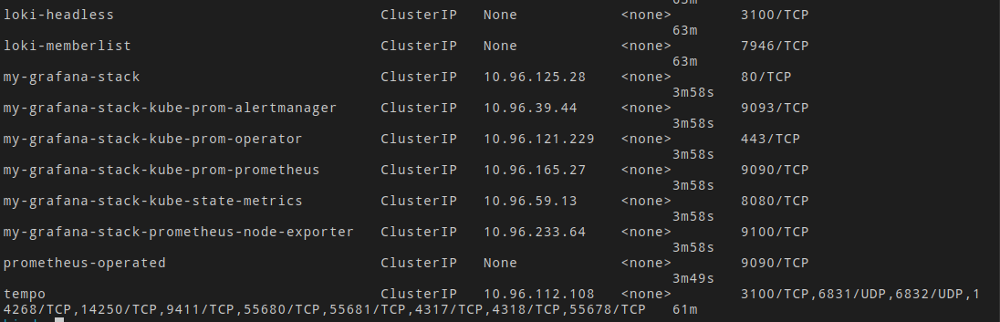 | 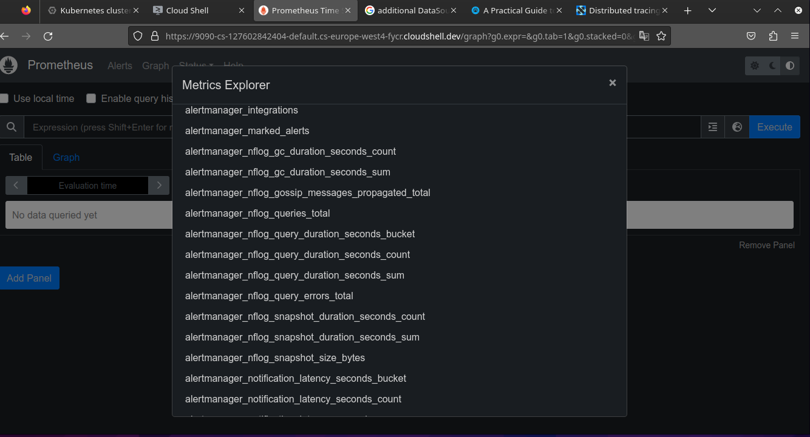 | 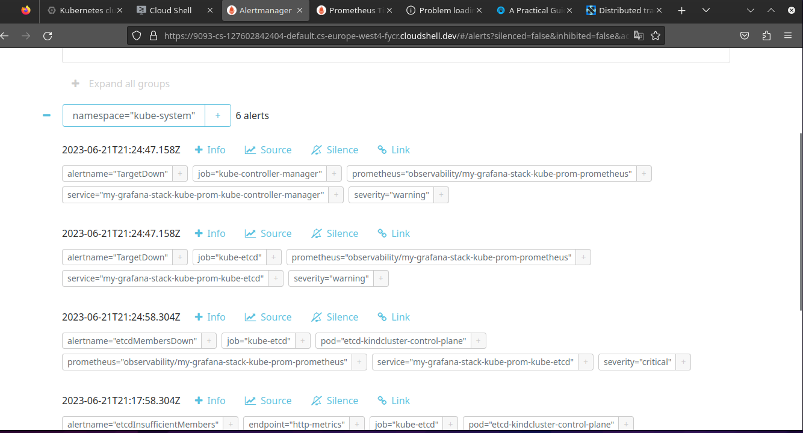 | 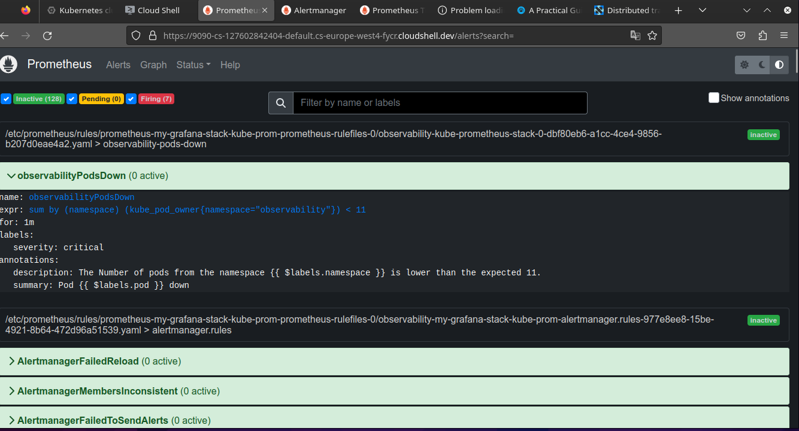 |

| Example 5 | Example 6 | Example 7 | Example 8 |
|-----------|-----------|-----------|-----------|
| 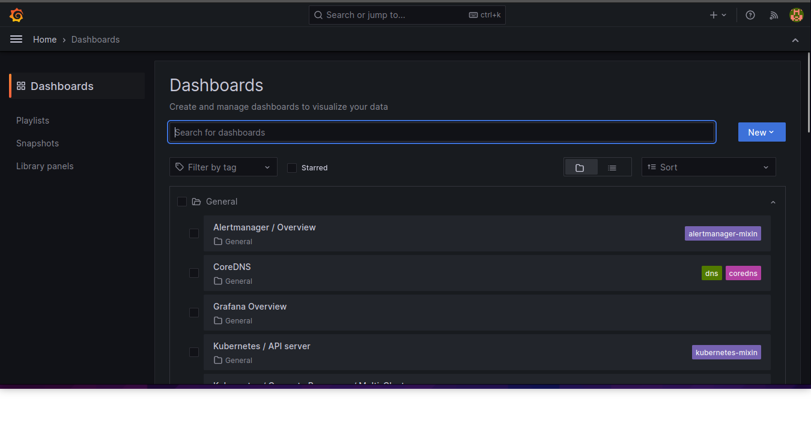 |  | 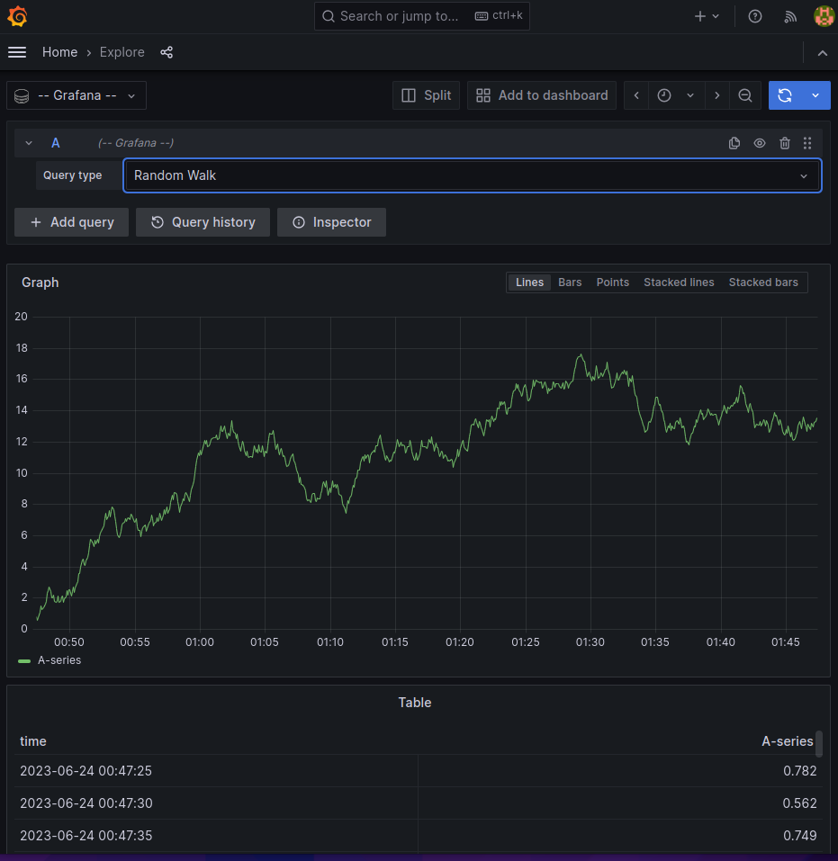 | 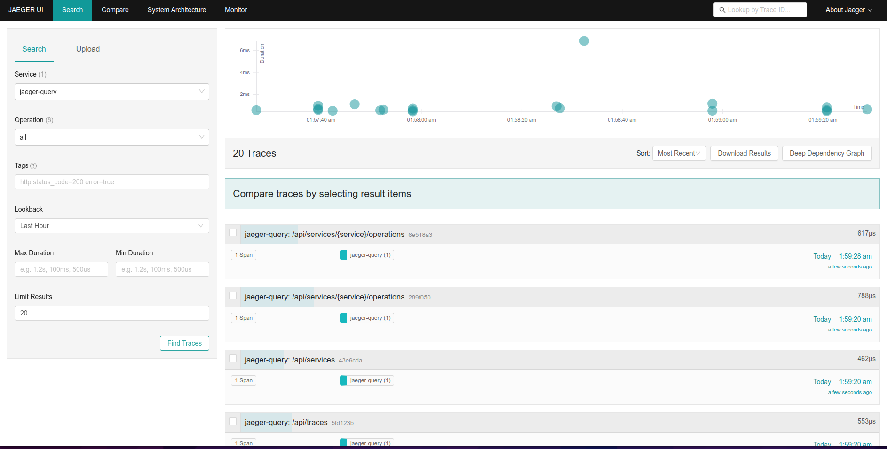 |

| Example 9 | Example 10 | Example 11 | Example 12 |
|-----------|------------|------------|------------|
| 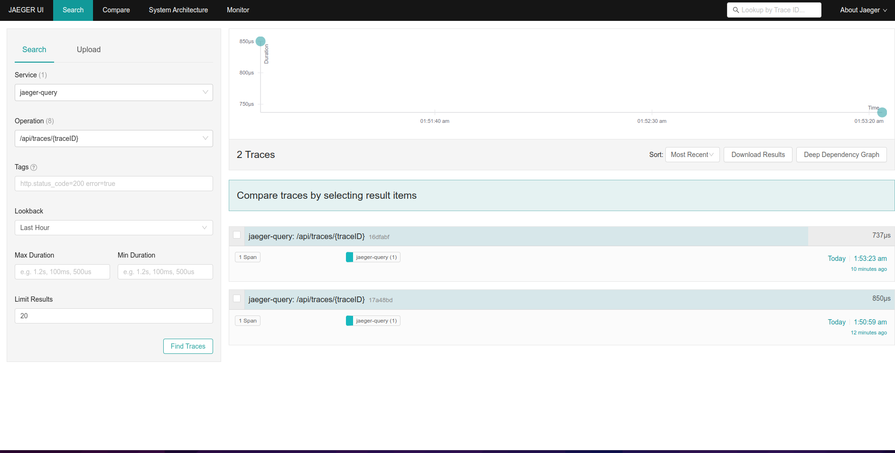 | 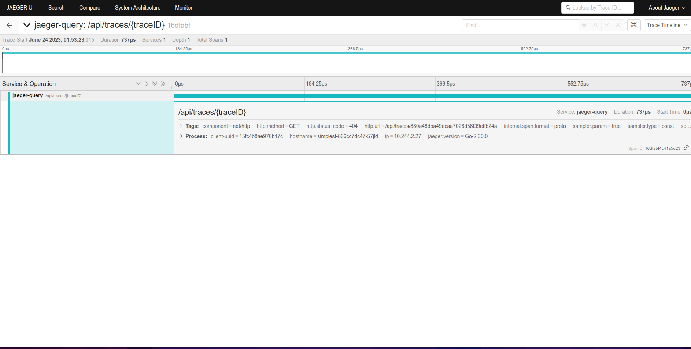 | 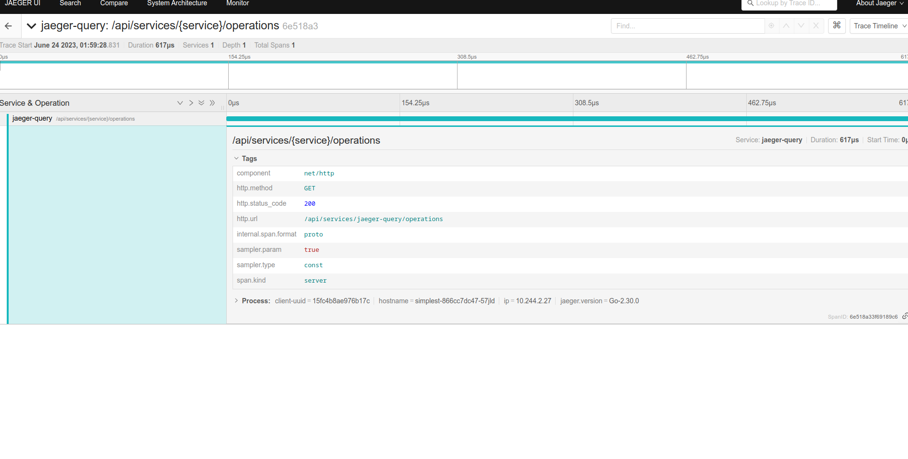 | 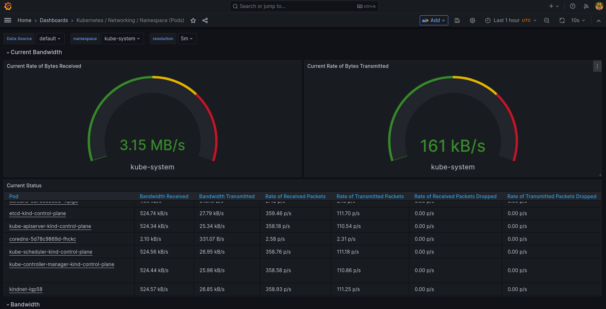 |

| Example 13 | Example 14 | Example 15 | Example 16 |
|------------|------------|------------|------------|
| 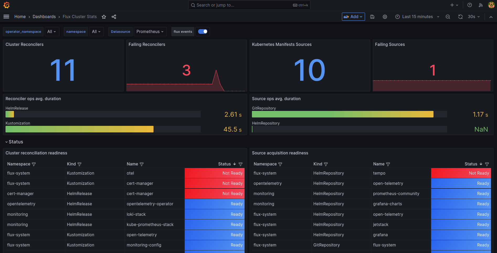 | 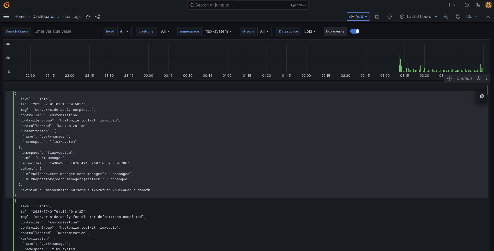 | 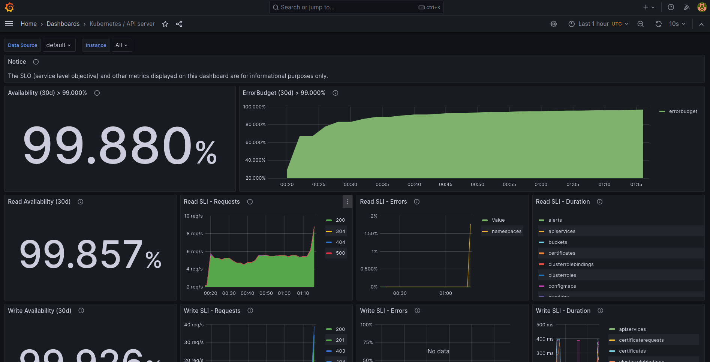 | 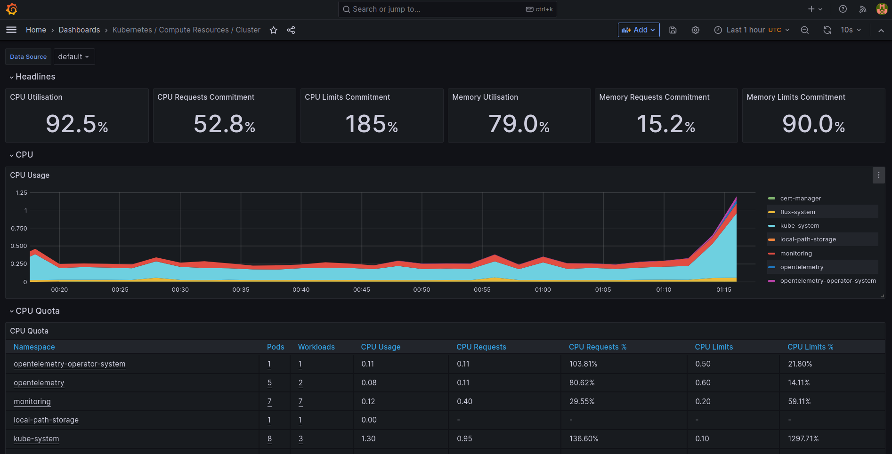 |

| Example 17 | Example 18 |
|------------|------------|
| 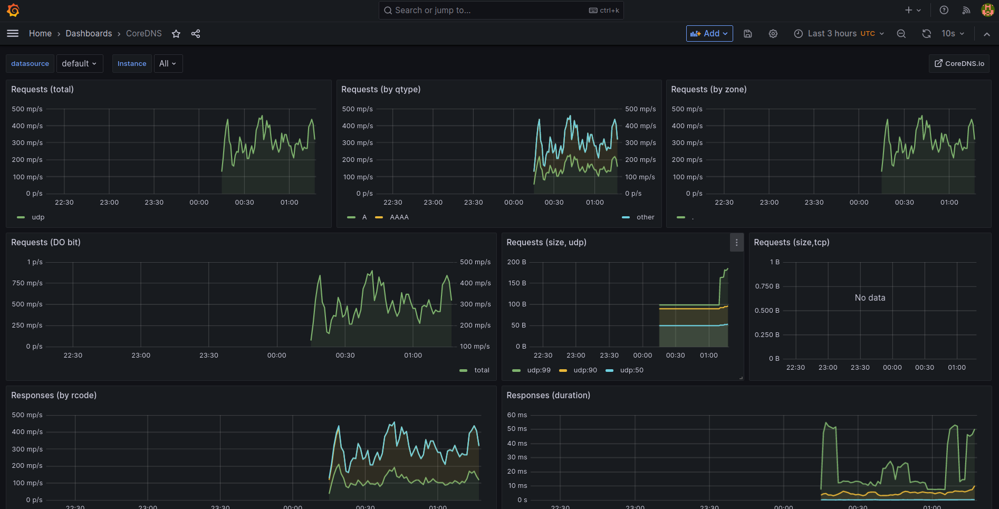 | 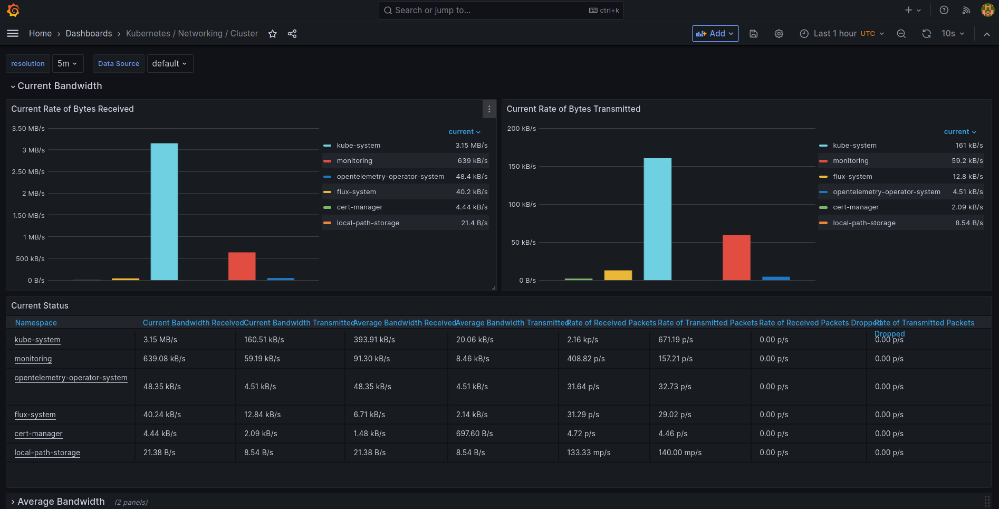 |


Дивіться демонстраційне відео на YouTube, щоб побачити налаштований стек моніторингу в дії: ](data/19.png)[Демо налаштованого стеку моніторингу](https://youtu.be/Gi-2FskO0jk).
